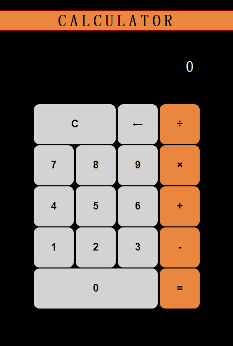

# *JS-CALCULATOR*
## A simple calculator designed with CSS Grid layout.



Designed from scratch using **HTML, CSS ans JavaScript** only, utilizing the CSS Grid layout for responsive design.

## Features

- Basic arithmetic operations: addition, subtraction, multiplication, division.
- Clear and concise user interface.
- Responsive layout designed with CSS Grid.
- Instant calculation results.
- Tab support for input buttons.

## Demo

Live Demo on [NETLIFY](https://silver-sawine-b198a8.netlify.app/)

## Getting Started

1. Clone the repository:

```bash
git clone https://github.com/PavanBhat007/JS-CALCULATOR.git
```
